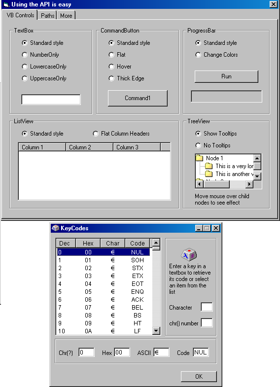



## API for beginners made easy

### Description

API for beginners made easy.

Yet another submission for beginners. The API is sometimes avoided when first starting VB programming because it seems too difficult. In fact it's quite easy, just experiment. I've tried to split the code up to into various modules to make it clearer to undertand. Vb controls sometimes lack some properties we as programmers need. The API can be used to return those properties to us. In addition API gives us access to built in dialogs and other functions not otherwise available through VB. This demo covers only a few of the more common API functions, there are hundreds and hundreds of others!

Modify VB Controls: Listview Flat Column headers, Treeview no tooltips, Progress bar change back/forecolor, Textbox - lower/uppercase and numbers only, Command button - thick edge, flat, hover.

Dialogs: Open, Save, Browse for Folder, Printer, PageSetup, Color, Font, Add to Favorites, Organize Favorites, Import/Export Favorites, About.

Functions: GUID Generator, Unique Temp filename, IE Version, Keycode giver, Hard Disk info, Common Paths, Long filename, Short filename, FileExists, Binary open/save

String Parsing: Pathonly, Fileonly, ExtensionOnly, ChangeExtension, Unique filename, File size, Trim null characters.

I recommend you visit www.allapi.net for excellent downloads regarding the API - but be quick, I understand the site is closing soon.
 
### More Info
 

             |
---                |---
**Submitted On**   |2002-05-29 11:40:46
**By**             |[MrBobo](https://github.com/Planet-Source-Code/PSCIndex/blob/master/ByAuthor/mrbobo.md)
**Level**          |Beginner
**User Rating**    |4.8 (134 globes from 28 users)
**Compatibility**  |VB 6\.0
**Category**       |[VB function enhancement](https://github.com/Planet-Source-Code/PSCIndex/blob/master/ByCategory/vb-function-enhancement__1-25.md)
**World**          |[Visual Basic](https://github.com/Planet-Source-Code/PSCIndex/blob/master/ByWorld/visual-basic.md)
**Archive File**   |[API\_for\_be879395282002\.zip](https://github.com/Planet-Source-Code/mrbobo-api-for-beginners-made-easy__1-35221/archive/master.zip)

